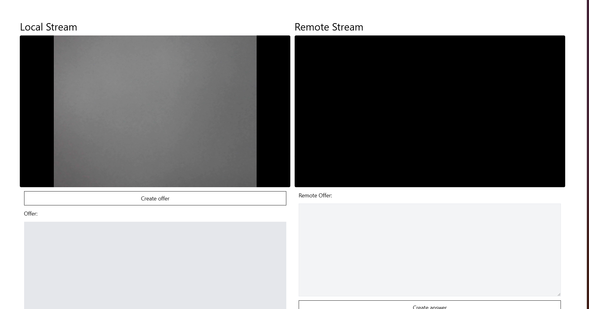
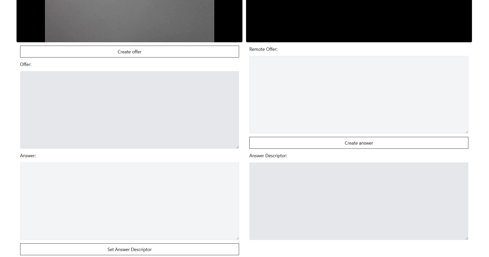

<div align="center">
  <h1 align="center">WebRTC Review</h1>
  <p align="center">The simplest possible WebRTC Video-call without signaling</p>
</div>

# Introduction

This is my personal note of reviewing and learning WebRTC. This prototype is basically a React version of [@traversy_media's work](https://github.com/divanov11/WebRTC-Simple-SDP-Handshake-Demo/) with tons of personal note. Although the note is personal, I hope this could help others get a deeper understanding of WebRTC's implementation. Something that I wished was available during my early years learning this technology (and not just some tutorials using libraries, such as PeerJS (Awesome library btw) ).

# Setup

```shell
# Usual cloning and setup
git clone https://github.com/plasteek/web-rtc-review
cd web-rtc-review
pnpm install

# Run the vite server
pnpm dev
```

# How to Use It

1. Allow the camera usage
2. Press the `Create Offer` and copy the text content
3. Go to another device with the website, paste the offer, and create the answer
4. Copy the generated answer and paste it to the original device
5. Click set answer descriptor and watch the device connects!

# Screenshots

_Stream Screen_



_Control Screen_


